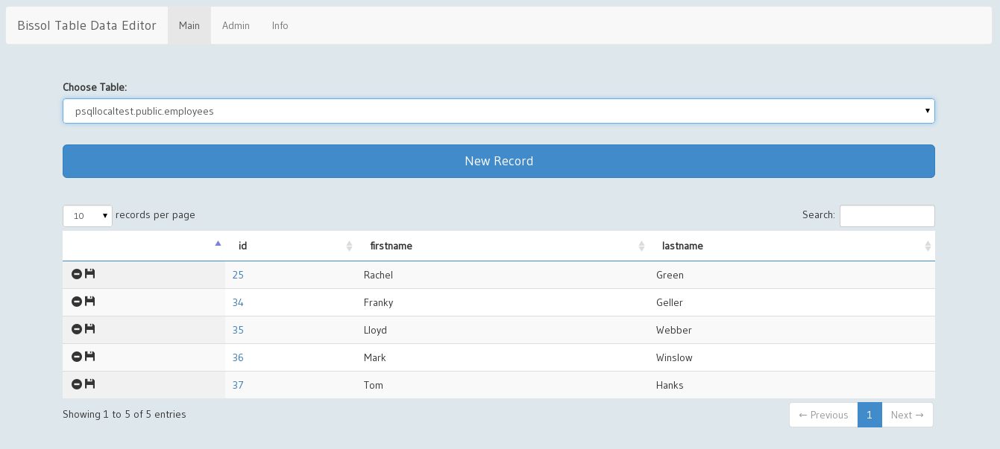

# Bissol Table Data Editor

> **WARNING**: Do not use in production! This project is in its early stages. Functionality has only been tested with PostgreSQL and MariaDB.

> **NOTE TO BETA TESTERS**: To get started, after downloading the project files just add the `pentaho-solutions/system/bissolTableDataEditor` folder to your biserver. Start the biserver - the plugin automatically copies the required Kettle plugins to the dedicated biserver Kettle plugin folder. You should then find the plugin listed in the **Tools** menu. **YOU MUST THEN RESTART THE SERVER TO BE ABLE TO USE THE PLUGIN** so that the Kettle plugins get registered.  Please report any bugs via the github project page in the **Issues** section.

## Screenshots

Admin page to configure tables which should be made available for editing:


Main page which allows standard end users to edit the data (add, update and delete records) of a specific table:



## Intended Purpose of the Plugin ##

The **Bissol Table Data Editor** (BTDE) Pentaho BI Server Plugin allows you to **update** and **add** data to **small database tables** via an easy-to-use web-interface.

Example **Use Cases**:

- Maintaining attribute fields in **dimension tables**. For some dimensions in a star schema you might ask end-users to add some additional information which is otherwise not available.
- Maintaining custom **configuration tables**
- Maintaining custom **metadata tables**

> **Note**: The **emphasis** is on maintaining **small tables**. The definition of **small** is anything that fits on a standard screen, so ideally less than a hundred records. As a safety measure, the BTDE limits the amount of data which can be displayed to 500 records.

## Additional Requirements for Installation ##

### BI / BA Server ###

This plugin will only work on biserver v5.1. with the latest version of the C*Tools installed.
Make sure you have at last on **data source** defined with a user which has **read and write** rights on the specific database.

### Kettle (PDI) Plugins ###

Currently **Sparkl** does't automatically include dependent PDI plugins. I have implemented a workaround so that these Kettle plugins get automatically installed on the first startup, after which you have to restart the biserver.

Following **Kettle** plugins will be automatically added to the `pentaho-solutions/system/kettle/plugins/steps` folder.

- [BA Server Utils](https://github.com/webdetails/kettle-baserver-utils)
- [JDBC Metadata](https://github.com/rpbouman/pentaho-pdi-plugin-jdbc-metadata/wiki/Installation)

### JDBC Driver

The respective JDBC driver have to be installed in `tomcat/lib`. This should already be the case if you defined **data sources** on the Pentaho BA Server.

## Current Limitations ##


- Only current web browsers are supported. The main editor page makes use of the *contenteditable* attribute which is only supported by recent web browsers.
- Only one columns is supported for the **primary key**. The primary key has to be defined for the update logic. Note that the primary key has to be properly defined with auto increment on the database side for this to work. 
- If there is a DB error while adding, updating or removing records, only a generic error is shown in the web UI. This has to do with the fact that currently PDI DB steps do not feed back any DB error message details. A Jira case has been created for this feature to be implemented.

## General Workflow

Once the plugin is installed a user of the role admin can select tables via the **Admin** page and choose which columns can be viewed and edited. Only then a standard end user can edit the data of a specific table via the **Main** page.

## Configuration

Administrators can enter the config information for each table via a dedicated **Admin** page in the **Pentaho User Console**. There is full support for adding, editing and deleting configuration entries. The configuration entries are stored in the `bissolTableDataEditorConfig.json` file on the server in following directory:

`pentaho-solutions/system/bissolTableDataEditorConfig`

### How the configuration is saved to JSON

The structure of the JSON object looks like this:

```json
[
  {
    "configId": "32s3a343as332sasf3",
    "dbConnection": "psqllocaltest",
    "dbSchema": "public",
    "dbTable": "employees",
    "metadata": [
      {
        "colIndex": 0,
        "colType": "Integer",
        "colName": "id",
        "isVisible": true,
        "isEditable": false,
        "isPrimaryKey": true
      },
      {
        "colIndex": 1,
        "colType": "String",
        "colName": "firstname",
        "isVisible": true,
        "isEditable": true,
        "isPrimaryKey": false
      },
      {
        "colIndex": 2,
        "colType": "String",
        "colName": "lastname",
        "isVisible": true,
        "isEditable": true,
        "isPrimaryKey": false
      }
    ]
  },
  {
    "configId": "4352dsg4234dfwe423",
    "dbConnection": "psqllocaltest",
    "dbSchema": "public",
    "dbTable": "pk_test",
    "metadata": [
      {
        "colIndex": 0,
        "colType": "Integer",
        "colName": "id",
        "isVisible": true,
        "isEditable": false,
        "isPrimaryKey": true
      },
      {
        "colIndex": 1,
        "colType": "String",
        "colName": "name",
        "isVisible": true,
        "isEditable": true,
        "isPrimaryKey": false
      }
    ]
  }
]
```

The file structure is pretty self-explanatory, hence I assume that you will find it easy to amend it. You should not have to edit this file manually.

### Explicit labeling of column config entries

If you **edit** a configuration entry (configuration for one table) the columns will be listed on the **Admin page**. Columns details that are already stored in the configuration file are labelled **Configured** whereas other ones are labelled **New**. This is especially useful when the table definition changes on the database side.
